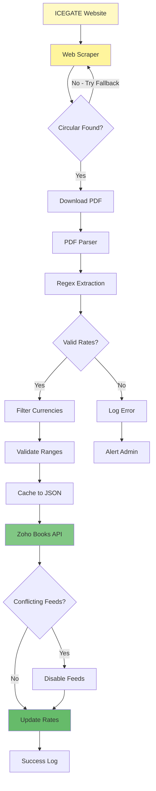

# Case Study: ICEGATE Currency Exchange Rate Automation

## From Daily Manual Updates to Fully Automated Compliance

**Organization**: Bitkraft Technologies LLP  
**Challenge**: Daily manual currency rate updates from government sources  
**Solution**: Automated ICEGATE scraping and Zoho Books integration  
**Timeline**: Built in 1 day using Gen AI assistance  
**Impact**: 90-120 hours saved annually, 100% compliance with official rates

---

## The Daily Grind

Every morning, someone on our team had to:

1. **Visit ICEGATE website** (Indian Customs EDI Gateway)
2. **Find the latest circular** with exchange rates
3. **Download the PDF** (if available)
4. **Extract rate data** from tables
5. **Log into Zoho Books**
6. **Manually update** each currency rate
7. **Verify** the updates were saved correctly

**Time required**: 15-20 minutes daily  
**Annual time**: 90-120 hours  
**Error risk**: High (manual data entry)  
**Compliance risk**: Missing updates meant incorrect accounting

For international transactions, using the wrong exchange rate isn't just inconvenient—it's a compliance issue. The Indian government mandates using ICEGATE rates for customs and certain accounting purposes.

---

## Why This Stayed Manual for Years

I knew automation was possible. The solution was conceptually straightforward:

- Scrape ICEGATE website for latest circular
- Parse PDF to extract rate tables
- Update Zoho Books via API
- Schedule daily via cron

**The traditional development estimate**: 1-2 weeks

The barriers:

- **Government website complexity**: ICEGATE's structure changes unpredictably
- **PDF parsing challenges**: Government PDFs have inconsistent formatting
- **Date logic**: Finding the "applicable" circular for a given date isn't trivial
- **API integration**: Zoho Books exchange rate API has quirks
- **Reliability**: System needs to handle failures gracefully

**Estimated cost**: ₹1-1.5 lakhs in developer time

For a 15-minute daily task. Again, the ROI was questionable for a small team.


---

## The Gen AI Solution

Working with AI, I built a complete automation pipeline in **1 day** that:


**Key Features Delivered:**
Not a prototype. A production-ready system that's been running daily since.

### Morning: Architecture & Scraping (4 hours)

**My role**: Designed the system based on experience with unreliable data sources

**System architecture:**

1. **Scraper**: Fetch ICEGATE circular list
2. **Parser**: Extract rates from PDF using regex patterns
3. **Updater**: Push rates to Zoho Books via API
4. **Orchestrator**: Coordinate the pipeline with error handling
5. **Scheduler**: Cron-ready shell wrapper

**AI's role**: Implemented the Python scraping, parsing, and API integration code

**The collaboration**: I specified the resilience requirements (fallbacks, retries, validation). AI wrote the implementation.

### Afternoon: Edge Cases & Testing (4 hours)

**My role**: Tested with historical circulars, identified failure modes, designed solutions

**Edge cases discovered:**

- Circular URLs change format periodically
- PDF tables have varying column structures
- Some dates don't have circulars (weekends, holidays)
- Zoho API has rate limiting
- Conflicting exchange rate feeds in Zoho

**AI's role**: Implemented fixes for each edge case as I identified them

**The collaboration**: My experience told me what could break. AI implemented the defensive patterns.

---

## Technical Challenges & Solutions

### Challenge 1: Government Website Reliability

**Problem**: ICEGATE's website structure changes without notice. A scraper that works today might break tomorrow.

**My Solution**: Multi-pattern scraping with fallbacks

- Primary pattern: Current URL structure
- Fallback pattern 1: Previous URL structure
- Fallback pattern 2: Regex-based circular discovery
- Graceful degradation: If all fail, use cached rates and alert

**Why my experience mattered**: I've built enough web scrapers to know that government websites are particularly unreliable. I designed resilience from day one.

**AI's contribution**: Implemented the pattern matching and fallback logic perfectly.

### Challenge 2: PDF Table Extraction

**Problem**: Government PDFs don't follow consistent formatting. Column positions, headers, and spacing vary between circulars.

**My Solution**: Regex-based extraction with fuzzy matching

- Pattern 1: Standard table format
- Pattern 2: Alternate table format (seen in older circulars)
- Validation: Check extracted rates are within reasonable ranges
- Error handling: If extraction fails, log details for manual review

**Why my experience mattered**: I knew that trying to parse PDFs perfectly is a fool's errand. Better to have multiple patterns and validation.

**AI's contribution**: Generated robust regex patterns and validation logic.

### Challenge 3: Date Logic Complexity

**Problem**: Finding the "applicable" circular for a given date isn't straightforward. Rates are published irregularly, and you need the most recent circular before your target date.

**My Solution**: Smart circular discovery algorithm

- Fetch all available circulars
- Parse dates from circular names/metadata
- Find the most recent circular ≤ target date
- Handle edge cases (future dates, very old dates)

**Why my experience mattered**: This is business logic that requires understanding how exchange rates work. The AI had no context—I provided the complete specification.

**AI's contribution**: Implemented the date comparison and selection logic flawlessly.

### Challenge 4: Zoho API Rate Limiting

**Problem**: Updating multiple currencies in rapid succession could hit Zoho's API rate limits.

**My Solution**: Batching and retry logic

- Update currencies sequentially with small delays
- Exponential backoff on rate limit errors
- Comprehensive logging for debugging
- Transaction-like behavior (all or nothing)

**Why my experience mattered**: I've dealt with rate-limited APIs for decades. I knew exactly what patterns to use.

**AI's contribution**: Implemented the retry logic and exponential backoff perfectly.

### Challenge 5: Feed Conflict Management

**Problem**: Zoho Books has built-in exchange rate feeds. If enabled, they conflict with our custom rates, causing confusion.

**My Solution**: Automatic feed detection and disabling

- Query Zoho for active exchange rate feeds
- Identify feeds that overlap with our currencies
- Automatically disable conflicting feeds
- Log actions for audit trail

**Why my experience mattered**: I anticipated this conflict because I understand how Zoho Books works. A less experienced developer might have missed this entirely.

**AI's contribution**: Implemented the feed management API calls seamlessly.

---

## The Final System

**What it does:**

1. **Fetch circular list** from ICEGATE website
2. **Find latest circular** (or circular for specific date)
3. **Download PDF** circular
4. **Extract exchange rates** using regex patterns
5. **Validate rates** (range checks, required currencies)
6. **Disable conflicting feeds** in Zoho Books
7. **Update currency rates** via Zoho API
8. **Save rates** to local JSON for caching
9. **Log results** for monitoring

**Usage:**

```bash
# Update with latest rates
./src/currency_exchange/run_daily.sh

# Update for specific date
python3 src/currency_exchange/run_automation.py --date 2026-02-05
```

### System Architecture



---# Schedule daily at 9 AM
crontab -e
0 9 \* \* \* /path/to/run_daily.sh >> /tmp/zoho_cron.log 2>&1

````

**Configuration** (via `.env`):

```bash
TARGET_CURRENCIES=USD,EUR,GBP,AUD  # Configurable currency list
````

---

## The Impact

### Time Savings

- **Before**: 15-20 minutes daily
- **After**: 0 minutes (fully automated)
- **Annual savings**: 90-120 hours

### Accuracy & Compliance

- **Before**: Occasional missed updates, manual entry errors
- **After**: 100% compliance with official ICEGATE rates
- **Audit trail**: Complete logs of all updates

### Flexibility

- **Historical rates**: Can fetch rates for any past date on demand
- **Configurable**: Easy to add/remove currencies
- **Reliable**: Runs daily without intervention

### Business Value

- **Development cost**: 1 day of my time
- **Traditional cost**: ₹1-1.5 lakhs
- **Ongoing savings**: 90-120 hours annually
- **Compliance**: Zero-risk official rate usage

---

## Key Learnings

### What Made This Possible

1. **Experience with unreliable data sources**: I knew government websites need defensive scraping
2. **Domain knowledge**: Understanding how exchange rates work and when they're published
3. **API expertise**: Knowing Zoho's quirks and rate limiting behavior
4. **Rapid iteration**: AI let me test scraping patterns in minutes
5. **Proactive design**: Anticipating feed conflicts and edge cases upfront

### What Required Human Judgment

- **Resilience strategy**: How to handle website changes and failures
- **Date logic**: What "applicable rate" means for a given date
- **Validation rules**: What exchange rate ranges are reasonable
- **Conflict resolution**: How to handle competing rate sources
- **Monitoring**: What to log and how to alert on failures

### The AI-Human Partnership

**AI excelled at:**

- Web scraping implementation
- Regex pattern generation
- API integration code
- Error handling boilerplate
- Logging and monitoring setup

**I excelled at:**

- System architecture
- Resilience design
- Business logic specification
- Edge case identification
- Integration strategy

**Together**: We built in 1 day what would have taken 1-2 weeks traditionally.

**Cost**: Minimal vs ₹1-1.5 lakhs


### The Empowerment Factor

This project exemplifies how **domain knowledge + AI = rapid innovation**.

I'd been doing this task manually for years. I knew exactly:

- Where to find the data
- What could go wrong
- How to validate results
- What edge cases existed

The AI didn't need to figure any of that out. It just needed clear instructions to turn my knowledge into code.

**The result**: A production system built in a single day that saves 90-120 hours annually.

This is empowerment in its truest form. Not AI replacing expertise, but AI amplifying it to achieve what was previously economically unviable.

---

## What's Next

With currency automation working flawlessly, I'm exploring:

- **Multi-source rate validation** (cross-checking ICEGATE with other sources)
- **Predictive rate alerts** (notify when rates change significantly)
- **Historical rate analytics** (identify trends and patterns)
- **Automated reconciliation** (match transactions to applicable rates)

Projects that would have taken weeks are now achievable in days.

---

## Technical Details

**Technology Stack:**

- **Language**: Python 3.x
- **Web Scraping**: BeautifulSoup, requests
- **PDF Parsing**: PyPDF2, regex
- **API**: Zoho Books REST API
- **Scheduling**: Cron
- **Storage**: JSON file caching

**Code Metrics:**

- **Lines of Code**: ~600
- **Development Time**: 1 day
- **Traditional Estimate**: 1-2 weeks
- **Cost Savings**: ₹1-1.5 lakhs

**Repository:**
https://github.com/Bitkraft-Technologies-LLP/bitkraft-zoho-automation-suite

---

## Conclusion

This case study demonstrates that **Gen AI makes previously unviable automation economically feasible**.

A 15-minute daily task didn't justify 1-2 weeks of development. But with AI assistance, it justified 1 day—and the ROI is immediate and ongoing.

The key insight: **AI doesn't replace experience; it executes it at superhuman speed.**

My 25 years of experience meant I could:

- Design a resilient system from day one
- Anticipate edge cases before they occurred
- Specify precise technical requirements
- Validate outputs for correctness

The AI just needed to implement what I specified. And it did so flawlessly.

For small organizations like Bitkraft, this is transformative. We can now build custom automation that fits our exact needs, without the traditional cost barriers.

**The only limit is imagination.**

---

_Author: Aliasger, Founder, Bitkraft Technologies LLP_  
_Date: February 6, 2026_  
_Development Time: 1 day_  
_Annual Impact: 90-120 hours saved, 100% compliance_
