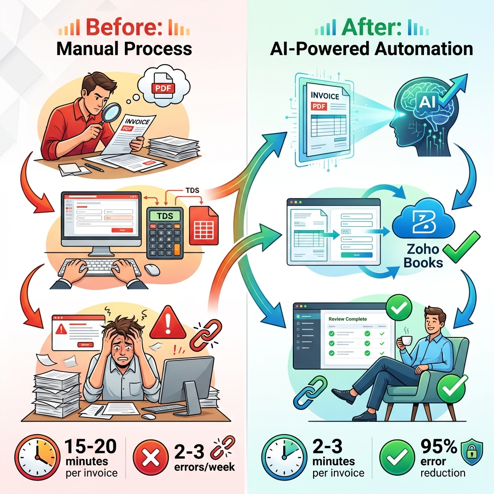
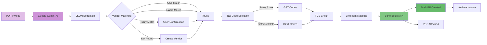
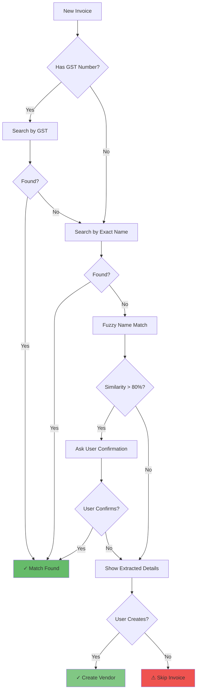
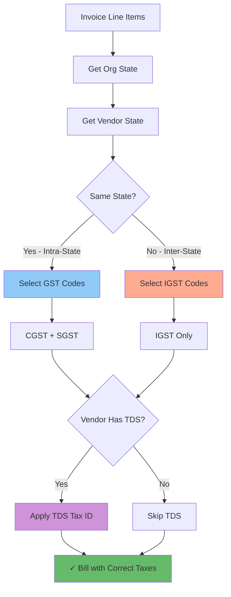
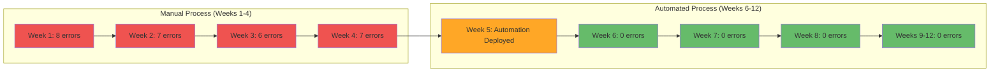

# Case Study: AI-Powered Invoice Processing for Zoho Books

## From 10 Hours Weekly to 2 Minutes Per Invoice

**Organization**: Bitkraft Technologies LLP  
**Challenge**: Manual invoice processing consuming 5-10 hours weekly  
**Solution**: AI-powered multimodal invoice extraction and Zoho Books integration  
**Timeline**: Built in 2 days using Gen AI assistance  
**Impact**: 95% error reduction, 260-520 hours saved annually

---

## The Pain Point

Every week, vendor invoices arrived as PDFs—some beautifully formatted digital documents, others barely legible scanned images. Each invoice required:

1. **Manual data extraction**: Reading vendor details, line items, amounts, taxes
2. **Vendor lookup**: Searching Zoho Books or creating new vendor records
3. **Expense mapping**: Categorizing each line item to the right account
4. **Tax calculations**: Determining GST vs IGST based on vendor state
5. **TDS application**: Calculating and applying tax deductions
6. **Bill creation**: Entering everything into Zoho Books
7. **Document attachment**: Uploading the original PDF

**Time per invoice**: 15-20 minutes  
**Weekly volume**: 20-30 invoices  
**Total time**: 5-10 hours per week

For a startup, this was unsustainable. But hiring someone full-time for data entry? Also not viable.



---

## Why I Never Built This Before

I'd been thinking about automating this for years. The solution was clear in my mind:

- Extract data from PDFs using OCR or parsing
- Match vendors in Zoho Books
- Map line items to expense accounts
- Apply business rules for taxes and TDS
- Create draft bills via API

**The traditional development estimate**: 2-3 weeks of full-time work

That meant:

- ₹2-3 lakhs in developer costs
- Weeks of testing with real invoices
- Ongoing maintenance as formats changed
- Risk of bugs causing accounting errors

For a small organization, the ROI just didn't justify it. The project stayed on my "someday" list.

---

## The Gen AI Breakthrough

In February 2026, I decided to try building this with AI assistance. Not as a proof of concept—as a production system.

**Total development time: 2 days**

Here's what made the difference:

### Day 1: Core Architecture (6 hours)

**My role**: Designed the system architecture based on 25 years of experience

- Multimodal AI extraction using Google Gemini (handles text + images)
- Multi-stage vendor matching (GST → exact name → fuzzy match)
- State-aware tax code selection
- TDS integration with Zoho's tax system
- Batch processing with archival

**AI's role**: Generated the TypeScript code structure, API integrations, and error handling

**The collaboration**: I provided precise technical specifications. The AI wrote clean, well-structured code. I reviewed and refined.

### Day 2: Edge Cases & Testing (8 hours)

**My role**: Tested with real invoices, identified edge cases, designed solutions

- Scanned invoices with poor quality
- Vendors with missing GST numbers
- Multi-page invoices
- Foreign currency invoices
- Complex line item structures

**AI's role**: Implemented fixes, added validation, improved error messages

**The collaboration**: I knew what could go wrong from years of dealing with messy data. AI implemented the defensive coding patterns I specified.

---

## Technical Challenges & Solutions

### Challenge 1: Unreliable AI Extraction

**Problem**: Early iterations produced inconsistent JSON outputs. Sometimes fields were missing, sometimes the structure was wrong.

**My Solution**: Designed a strict schema with validation and fallback mechanisms. If Gemini's output doesn't match the schema, the system asks for re-extraction with more specific prompts.

**Why my experience mattered**: I've built enough data extraction systems to know that AI outputs need validation. I specified exactly what to check and how to handle failures.

**AI's contribution**: Implemented the validation logic and retry mechanisms flawlessly.

### Challenge 2: Vendor Matching Complexity

**Problem**: Real-world vendor data is messy. "ABC Pvt Ltd" vs "ABC Private Limited" vs "ABC". GST numbers might be missing or incorrect.

**My Solution**: Three-tier matching strategy:

1. Exact GST match (highest confidence)
2. Exact name match (medium confidence)
3. Fuzzy name match with similarity threshold (requires confirmation)

**Why my experience mattered**: I've dealt with data quality issues for decades. I knew a simple exact match wouldn't work in production.

**AI's contribution**: Implemented the fuzzy matching algorithm and confidence scoring system.

### Challenge 3: Interactive Vendor Creation

**Problem**: When a vendor isn't found, we need to create it—but with complete, accurate information.

**My Solution**: Designed an interactive CLI that:

- Shows all extracted vendor details (name, GST, PAN, address, bank details)
- Asks for confirmation before creating
- Stores bank details in notes field (Zoho API limitation)
- Validates required fields

**Why my experience mattered**: I knew exactly what information we'd need later for payments and compliance. The AI didn't need to understand Indian tax law—I did.

**AI's contribution**: Built the interactive prompts and Zoho API integration.

### Challenge 4: State-Aware Tax Mapping

**Problem**: India's GST system requires different tax codes for intra-state vs inter-state transactions. Using the wrong code causes compliance issues.

**My Solution**: Automatic tax code selection based on:

- Organization state (from config)
- Vendor state (from Zoho Books)
- If same state → GST tax codes
- If different state → IGST tax codes

**Why my experience mattered**: This is domain knowledge from years of Indian accounting. The AI had no context for this—I provided the complete business logic.

**AI's contribution**: Implemented the state comparison and tax code lookup perfectly.

### Challenge 5: TDS Integration

**Problem**: TDS (Tax Deducted at Source) must be calculated and applied correctly. Errors mean compliance violations.

**My Solution**:

- Check if vendor has TDS configured in Zoho
- If yes, apply the configured TDS tax ID and percentage
- Calculate the deduction amount
- Include in bill creation API call

**Why my experience mattered**: I knew TDS was critical and couldn't be an afterthought. I designed it into the core flow from day one.

**AI's contribution**: Integrated with Zoho's TDS API endpoints seamlessly.

---

## The Final System

**What it does:**

1. **Scan directory** for new PDF invoices
2. **Extract data** using Google Gemini multimodal AI
3. **Match vendor** using three-tier strategy
4. **Create vendor** interactively if not found
5. **Map line items** to expense accounts
6. **Select tax codes** based on state
7. **Apply TDS** if configured
8. **Create draft bill** in Zoho Books
9. **Attach PDF** to the bill
10. **Archive invoice** to prevent reprocessing

**Usage:**

```bash
# Process single invoice
npx ts-node src/invoice_processing/index.ts invoice.pdf

# Batch process all invoices
npx ts-node src/invoice_processing/index.ts

# Dry run (extract only, don't create bill)
npx ts-node src/invoice_processing/index.ts invoice.pdf --dry-run
```

### System Architecture



### Vendor Matching Logic



### Tax Code Selection Logic



---

## The Impact

### Time Savings

- **Before**: 15-20 minutes per invoice
- **After**: 2-3 minutes per invoice (mostly review time)
- **Weekly savings**: 4-9 hours
- **Annual savings**: 260-520 hours

### Error Reduction

- **Before**: 2-3 data entry errors per week
- **After**: Near-zero errors (AI extraction is consistent)
- **Error reduction**: ~95%

### Error Reduction Over Time



### Process Improvement

- **Batch processing**: Can process 30 invoices in 10 minutes
- **Automatic archival**: No duplicate processing
- **Audit trail**: Original PDFs attached to bills
- **Consistency**: Same rules applied every time

### Business Value

- **Development cost**: Essentially free (2 days of my time)
- **Traditional cost**: ₹2-3 lakhs
- **Ongoing savings**: 260-520 hours annually
- **Scalability**: Can handle 10x volume without additional resources


---

## Key Learnings

### What Made This Possible

1. **Clear architectural vision**: 25 years of experience meant I knew exactly what to build
2. **Domain expertise**: Understanding Indian tax law, accounting principles, and Zoho's API
3. **Rapid iteration**: AI allowed me to test ideas in minutes, not days
4. **Quality focus**: I could review code critically and spot issues immediately
5. **Precise direction**: Technical specifications that leveraged best practices

### What Required Human Judgment

- **Business logic**: When to match vendors, when to create new ones
- **Regulatory compliance**: GST, IGST, TDS rules
- **Error handling**: What to do when extraction fails
- **User experience**: Interactive prompts and confirmation flows
- **Data validation**: What fields are required, what can be optional

### The AI-Human Partnership

**AI excelled at:**

- Writing boilerplate code
- Implementing well-specified algorithms
- API integration
- Error handling patterns
- Code structure and organization

**I excelled at:**

- System architecture
- Business logic design
- Edge case identification
- Regulatory compliance
- Quality assurance

**Together**: We built in 2 days what would have taken 2-3 weeks traditionally.

---

## The Empowerment Factor

This project changed how I think about what's possible. For years, I knew this automation would save hours every week. But the traditional development cost made it unviable.

**Gen AI removed that barrier.**

Now, the limiting factor isn't development time or cost—it's imagination and prioritization. If I can describe what I want clearly (which my experience enables), AI can build it rapidly.

This isn't about AI replacing developers. It's about **experienced professionals becoming exponentially more productive**.

My 25 years of experience didn't become obsolete—it became the secret weapon. The AI didn't need to understand accounting, tax law, or data quality issues. I did. The AI just needed to execute my vision with superhuman speed.

---

## What's Next

With invoice processing automated, I'm looking at:

- **Automated expense categorization** using ML on historical patterns
- **Intelligent reconciliation** matching payments to invoices
- **Anomaly detection** flagging unusual amounts or vendors
- **Predictive analytics** for cash flow forecasting

Projects that were "someday" are now "this week."

---

## Technical Details

**Technology Stack:**

- **AI**: Google Gemini 2.0 Flash (multimodal)
- **Language**: TypeScript/Node.js
- **PDF Parsing**: pdf-parse library
- **API**: Zoho Books REST API
- **Storage**: Local file system with archival

**Code Metrics:**

- **Lines of Code**: ~1,200
- **Development Time**: 2 days
- **Traditional Estimate**: 2-3 weeks
- **Cost Savings**: ₹2-3 lakhs

**Repository:**
https://github.com/Bitkraft-Technologies-LLP/bitkraft-zoho-automation-suite

---

## Conclusion

This case study proves that **Gen AI has democratized sophisticated automation**. Small organizations can now build custom solutions that were previously only accessible to enterprises with large IT budgets.

The key isn't AI alone—it's **experienced professionals using AI as a force multiplier**.

For Bitkraft Technologies, this invoice automation is saving hundreds of hours annually and eliminating errors. But more importantly, it's proven that with Gen AI, **the only limit is imagination**.

---

_Author: Aliasger, Founder, Bitkraft Technologies LLP_
_Date: February 6, 2026_
_Development Time: 2 days_
_Annual Impact: 260-520 hours saved_

```

```
