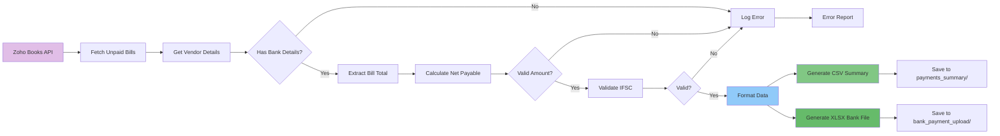
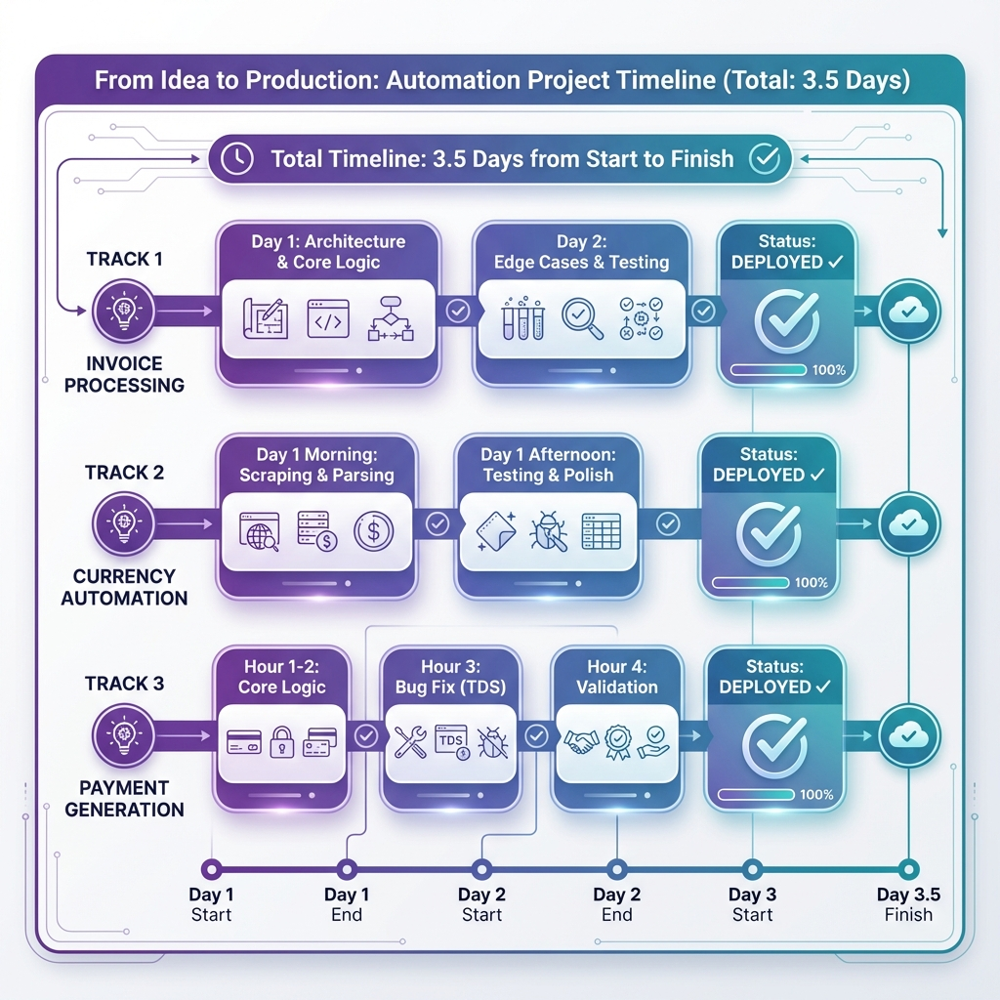

# Case Study: Bank Payment File Generation with TDS Automation

## From 3 Hours Monthly to 5 Minutes

**Organization**: Bitkraft Technologies LLP  
**Challenge**: Error-prone manual payment file generation with TDS calculations  
**Solution**: Automated payment file generation with TDS-aware calculations  
**Timeline**: Built in 4 hours using Gen AI assistance  
**Impact**: Near-zero errors, 24-36 hours saved annually

---

## The Monthly Headache

Every month, we needed to pay our vendors through the bank's bulk payment system. The process was tedious and error-prone:

1. **Export unpaid bills** from Zoho Books
2. **Calculate net amounts** after TDS deductions (manually!)
3. **Look up vendor bank details** from various sources
4. **Format data** into bank-specific XLSX template
5. **Generate CSV summary** for our records
6. **Verify everything** (because mistakes mean wrong payments)
7. **Upload to bank portal**

**Time required**: 2-3 hours monthly  
**Error rate**: 2-3 errors per month (wrong amounts, missing bank details)  
**Stress level**: High (payment errors cause vendor disputes and compliance issues)

The TDS calculations were particularly tricky. Some vendors have TDS, some don't. The rates vary. And if you deduct TDS twice by mistake, you've underpaid the vendor and created an accounting mess.

---

## Why This Stayed Manual

I'd thought about automating this many times. The logic was clear:

- Fetch unpaid bills from Zoho Books API
- Calculate net payable (bill amount - TDS)
- Format into bank's XLSX template
- Generate summary CSV

**The traditional development estimate**: 1 week

The concerns:

- **TDS calculation complexity**: Getting this wrong has serious consequences
- **Bank format requirements**: Banks are very particular about file formats
- **Data validation**: Missing bank details would cause payment failures
- **Testing**: Need to verify with real data before trusting it

**Estimated cost**: ₹80,000-1 lakh

For a monthly task taking 2-3 hours, the investment seemed excessive. So I kept doing it manually.

---

## The Gen AI Solution

In February 2026, I built this automation in **4 hours** with AI assistance.

Not a prototype. A production system I've used for actual bank payments.

### Hour 1-2: Core Logic

**My role**: Specified the exact requirements based on our bank's format and TDS rules

**Requirements:**

- Fetch all unpaid bills from Zoho Books
- For each bill, get vendor bank details
- Calculate TDS amount if vendor has TDS configured
- Calculate net payable (bill amount - TDS)
- Format into bank's XLSX template (specific columns, order, formatting)
- Generate CSV summary for our records
- Configurable paths and formats via environment variables

**AI's role**: Implemented the Zoho API integration, TDS calculations, and file generation

**The collaboration**: I provided the business logic and format specifications. AI wrote the code.

### Hour 3: Bug Fix (The TDS Double-Deduction)

**My role**: Tested with real data, spotted a critical bug

**The bug**: TDS was being deducted twice—once in the bill total, once in our calculation. This would have caused significant underpayments.

**How I caught it**: The numbers didn't look right. With 25 years of accounting experience, I could tell the net amounts were too low.

**AI's role**: Fixed the calculation logic immediately once I explained the issue

**The collaboration**: My domain knowledge caught a bug that could have caused serious problems. AI fixed it in minutes.

### Hour 4: Validation & Polish

**My role**: Added comprehensive validation rules based on past payment failures

**Validation requirements:**

- Verify all vendors have bank details
- Check amounts are positive and reasonable
- Validate IFSC codes (basic format check)
- Ensure no duplicate payments
- Clear error messages for any issues

**AI's role**: Implemented all validation logic and error handling

**The collaboration**: I knew what could go wrong from experience. AI implemented the checks.

---

## Technical Challenges & Solutions

### Challenge 1: TDS Calculation Accuracy

**Problem**: Early version had a critical bug causing double TDS deduction.

**My Solution**: Realized that Zoho's bill total already includes TDS deduction. Our calculation should be:

- If TDS configured: `net_payable = bill_total` (TDS already deducted by Zoho)
- If no TDS: `net_payable = bill_total`

Wait, that's the same! The insight: We don't need to calculate TDS ourselves—Zoho already did it. We just need to use the bill total.

**Why my experience mattered**: I immediately recognized the numbers were wrong. A less experienced person might have missed this until actual payments failed.

**AI's contribution**: Fixed the logic instantly once I explained the issue.

### Challenge 2: Bank Format Requirements

**Problem**: Banks have very specific requirements for bulk payment files:

- Exact column order
- Specific column headers
- Date formats
- Amount formatting (no currency symbols, specific decimal places)
- File naming conventions

**My Solution**: Created a detailed specification of our bank's format and made it configurable via environment variables for future flexibility.

**Why my experience mattered**: I'd dealt with bank file formats before and knew they're inflexible. Better to get it exactly right from the start.

**AI's contribution**: Generated perfect XLSX files using the xlsx library with exact formatting.

### Challenge 3: Data Integrity

**Problem**: Missing vendor bank details would cause payment failures at the bank.

**My Solution**: Comprehensive validation before file generation:

- Check all vendors have account number, IFSC, bank name
- Validate IFSC format (11 characters, alphanumeric)
- Verify amounts are positive
- List any bills that can't be processed with clear reasons

**Why my experience mattered**: I'd experienced payment failures due to missing data. I knew exactly what to check.

**AI's contribution**: Implemented all validation logic with clear error messages.

### Challenge 4: File Organization

**Problem**: Monthly payment files need clear organization for record-keeping and auditing.

**My Solution**: Date-based naming and configurable directories:

- CSV summary: `unpaid_bills_MMM-YYYY.csv`
- Bank XLSX: `bank_payment_MMM-YYYY.xlsx`
- Separate directories for summaries vs bank uploads
- All paths configurable via `.env`

**Why my experience mattered**: I knew we'd need to find these files months later for audits. Good organization from day one saves headaches later.

**AI's contribution**: Implemented the file naming and directory structure perfectly.

### Challenge 5: Configurable Advice Text

**Problem**: Banks require "advice text" for each payment (shows up on vendor's statement). We wanted a consistent format but needed flexibility.

**My Solution**: Template-based advice text via environment variable:

```bash
BANK_ADVICE_FORMAT="Inv pay {invoice_number}"
```

The system substitutes `{invoice_number}` with the actual invoice number.

**Why my experience mattered**: I knew we might want to change this format later. Making it configurable from day one avoided future code changes.

**AI's contribution**: Implemented the template substitution logic cleanly.

---

## The Final System

**What it does:**

1. **Fetch unpaid bills** from Zoho Books via API
2. **Get vendor details** including bank information
3. **Calculate net payable** (bill total, already includes TDS)
4. **Validate data** (bank details, amounts, IFSC codes)
5. **Generate CSV summary** with all bill details
6. **Generate bank XLSX** in exact required format
7. **Save to configured directories** with date-based naming
8. **Report any issues** with clear error messages

**Usage:**

```bash
# Generate payment files for all unpaid bills
npx ts-node src/payment_automation/generate-bank-payment.ts
```

### System Architecture





---

**Output:**

- `data/payments_summary/unpaid_bills_FEB-2026.csv`
- `data/bank_payment_upload/bank_payment_FEB-2026.xlsx`

**Configuration** (via `.env`):

```bash
PAYMENTS_SUMMARY_DIR=./data/payments_summary
BANK_PAYMENT_UPLOAD_DIR=./data/bank_payment_upload
BANK_ADVICE_FORMAT="Inv pay {invoice_number}"
```

---

## The Impact

### Time Savings

- **Before**: 2-3 hours monthly
- **After**: 5 minutes monthly (just review and upload)
- **Annual savings**: 24-36 hours

### Error Reduction

- **Before**: 2-3 errors per month (wrong amounts, missing details)
- **After**: Near-zero errors (validation catches issues before file generation)
- **Error reduction**: ~95%

### Process Improvement

- **Consistency**: Same format every time
- **Validation**: Catches issues before payment submission
- **Audit trail**: CSV summaries for record-keeping
- **Confidence**: No more anxiety about payment errors

### Business Value

- **Development cost**: 4 hours of my time
- **Traditional cost**: ₹80,000-1 lakh
- **Ongoing savings**: 24-36 hours annually
- **Risk reduction**: Eliminated payment errors and vendor disputes

---

## Key Learnings

### What Made This Possible

1. **Domain expertise**: Understanding TDS, bank formats, and payment processes
2. **Rapid testing**: Could test with real data and spot issues immediately
3. **Critical review**: My accounting knowledge caught the TDS bug instantly
4. **Precise specifications**: Knew exactly what the bank required
5. **Proactive validation**: Anticipated failure modes from past experience

### What Required Human Judgment

- **TDS logic**: Understanding how Zoho handles TDS deductions
- **Bank requirements**: Knowing exact format specifications
- **Validation rules**: What to check before generating files
- **Error handling**: What messages would be helpful
- **File organization**: How to structure for future auditing

### The AI-Human Partnership

**AI excelled at:**

- Zoho API integration
- Excel file generation
- Data formatting and transformation
- Validation logic implementation
- Error message generation

**I excelled at:**

- Business logic specification
- Bug detection (the TDS issue)
- Format requirements
- Validation rule design
- User experience design

**Together**: We built in 4 hours what would have taken 1 week traditionally.

---

## The Empowerment Factor

This was the fastest of the three automation projects, proving that **AI can turn hours of monthly work into minutes**.

The key was my ability to:

- **Specify exactly** what the output should look like
- **Catch errors immediately** during testing
- **Provide precise corrections** when issues arose

The AI didn't need to understand Indian tax law, bank requirements, or accounting principles. I did. The AI just needed to execute my specifications.

**The result**: A production system built in half a workday that eliminates a monthly headache.

This is empowerment. Not AI replacing expertise, but AI executing expertise at superhuman speed.

---

## What's Next

With payment file generation automated, I'm exploring:

- **Payment status tracking** (automatically update Zoho when bank confirms payments)
- **Reconciliation automation** (match bank statements to payments)
- **Cash flow forecasting** (predict upcoming payment obligations)
- **Vendor payment analytics** (identify patterns and optimize payment timing)

Projects that would have taken weeks are now achievable in hours or days.

---

## Technical Details

**Technology Stack:**

- **Language**: TypeScript/Node.js
- **API**: Zoho Books REST API
- **File Generation**: xlsx library
- **Configuration**: dotenv
- **Validation**: Custom logic with comprehensive checks

**Code Metrics:**

- **Lines of Code**: ~700
- **Development Time**: 4 hours
- **Traditional Estimate**: 1 week
- **Cost Savings**: ₹80,000-1 lakh

**Repository:**
https://github.com/Bitkraft-Technologies-LLP/bitkraft-zoho-automation-suite

---

## Conclusion

This case study demonstrates that **Gen AI makes even small automation projects economically viable**.

A 2-3 hour monthly task didn't justify a week of development. But with AI assistance, it justified 4 hours—and the ROI is immediate.

The critical factor: **My 25 years of experience caught a bug that could have caused serious payment errors.**

AI wrote the code quickly, but human expertise ensured it was correct. That's the partnership that makes Gen AI so powerful.

For small organizations like Bitkraft, this is transformative. We can now automate processes that were too small to justify traditional development, but too important to leave error-prone.

**The result**: More time for strategic work, less time on tedious tasks, and confidence that our systems are robust.\*\*

---

_Author: Aliasger, Founder, Bitkraft Technologies LLP_  
_Date: February 6, 2026_  
_Development Time: 4 hours_  
_Annual Impact: 24-36 hours saved, ~95% error reduction_
