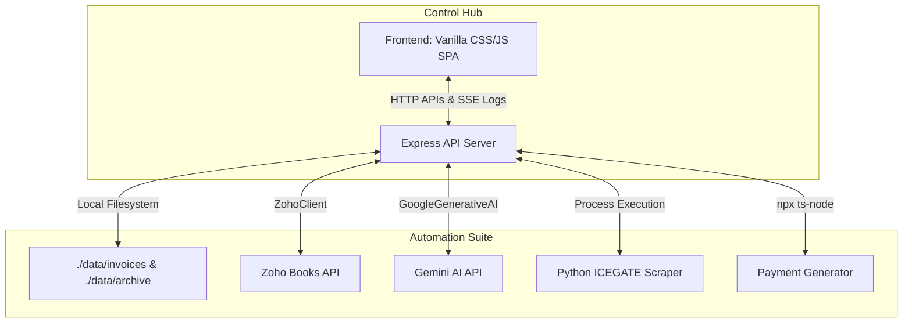

# Case Study: Unified Web-Based Control Center Dashboard

## From Cumbersome Terminal Prompts to a Premium Interactive Control Hub

**Organization**: Bitkraft Technologies LLP  
**Challenge**: CLI automation was powerful but cumbersome, difficult to configure, and hard to inspect for errors or unregistered vendors  
**Solution**: A high-end local Web Control Center SPA utilizing an Express backend, SSE real-time logging, glassmorphism aesthetics, side-by-side PDF previewing, and visual environment management  
**Timeline**: Built in 2 days using Gen AI assistance (June 2026)  
**Impact**: Absolute visual control, 100% visibility during executions, instant vendor creation, direct payment file downloads, and zero configuration friction  

---

## The Pain Point: The Friction of CLI-Only Operations

While the initial Zoho Books Automation Suite was highly performant, it lived entirely in the terminal. This created several operational friction points:

1. **Blind Processing**: Running the invoice script gave no immediate confirmation of progress, extraction status, or visual feedback until execution finished.
2. **Cumbersome Vendor Creation**: When the AI-extractor detected a new/unregistered vendor, it prompted for creation inside a text terminal, requiring manual input for missing details without a preview of the source PDF.
3. **Implicit Execution Failures**: If network issues or API rate limits occurred, failures were sometimes swallowed by catch blocks or returned long, unreadable HTML stack traces inside a small console.
4. **Config Rigidity**: Modifying active file directories, advice texts, or target currencies required opening and manually modifying the `.env` file in an IDE—which is highly prone to syntax mistakes.
5. **Awkward Downloads**: Payment XLSX sheets and CSV audits generated by scripts had to be fetched manually from deep within the file explorer.

**The Solution was Clear**: A unified local **Web Dashboard** that exposes every single automation script visually, securely, and interactively.

---

## Why I Never Built This Before (The Traditional Barrier)

Building a modern, highly polished web interface from scratch is traditionally a significant undertaking:

- **2-3 weeks** of development for building a web server, frontend structure, CSS layouts, and SSE streaming log integrations.
- Setup of complex frontend bundlers, routing libraries, and compilation layers.
- Integration of custom PDF previewers, state synchronizations, and form bindings.
- Estimated cost: **₹1.5-2.5 lakhs** in development time.

For a single-user local tool, investing that budget was out of the question. However, with Gen AI as a force multiplier, I built a production-grade Web Dashboard in just **2 days**.

---

## The Gen AI Solution: The Control Center

Working with an AI coding assistant, I built the entire **Zoho Books Automation Web Control Center** at `http://localhost:3000`.

### Day 1: Backend API Server & SPA Core (8 hours)

**My role**: Defined structural API specifications, directory config patterns, and SSE pipeline architecture.

- **Express Server (`server.ts`)**: Serves public assets, exposes `/api/status`, `/api/config` GET/POST, `/api/invoices` list/upload/delete/extract/create-vendor/approve, `/api/currency/run` (SSE), `/api/payment/generate` (SSE), and direct download routes.
- **Unified Single-Page App (`index.html`)**: Beautiful sidebar navigation layout using Outfit/Inter typography.
- **Glassmorphic Theme (`style.css`)**: Premium Dark Slate palette (`hsl(225, 22%, 8%)`), glassmorphism cards, glowing status rings, and smooth scale animations.

**AI's role**: Generated Express endpoint code, handled file multipart processing via `multer`, and coded the responsive CSS styles.

### Day 2: Interactive Features & Logging (8 hours)

**My role**: Guided the state-management flows, designed the side-by-side verification pane, and created the decoupled OAuth token propagation model.

- **Split-Screen Invoice Reviewer**: Integrates an iframe PDF preview on the left and a live-updating editable form on the right.
- **Real-Time Terminal Console**: Integrates Server-Sent Events (SSE) that stream stdout from Python subprocesses line-by-line onto a dark glowing console box.
- **Visual Config Editor**: Fully reads and rewrites `.env` variables from the UI.
- **One-Click Downloads**: Visual payment file cards with direct downloading.

**AI's role**: Coded XHR file uploads with custom progress bars, hooked up SSE streams, and managed form validations.

---

## Technical Challenges & Solutions

### Challenge 1: The Zoho OAuth Race-Condition & Rate Limits
* **Problem**: Running the currency scraper spawned a Python script (`update_zoho_rates.py`) that refreshed its own OAuth token independently. Because the dashboard had recently refreshed the token in Node.js, Zoho blocked the Python script's token refresh with: `Access Denied: You have made too many requests continuously.`
* **Solution**: Implemented **decoupled token sharing**. In `server.ts`, we pre-fetch a valid token from the Node.js `ZohoClient` before spawning the python script. This token is passed down as a `ZOHO_ACCESS_TOKEN` environment variable. The Python script checks for this variable; if present, it skips its own OAuth refresh completely and uses it directly.
* **Why my experience mattered**: I understood that rate limits require a unified token cache rather than independent auth sequences.
* **AI's contribution**: Coded the environment injection and modified the Python `get_access_token` utility to respect the override.

### Challenge 2: HTML Tracebacks Breaking the Extraction UI
* **Problem**: If the AI extractor hit a 500 error, Node.js returned HTML stack tracebacks. The frontend expected JSON, causing an `Unexpected token <` parsing error in Chrome, crashing the extractor window silently.
* **Solution**: Developed a robust two-layer response handler in `app.js` that checks response headers and falls back to clean plain-text parsing to render beautiful diagnostic boxes if JSON parsing fails.
* **AI's contribution**: Implemented the fallback error handler on the client side.

---

## The Final System: Visual Dashboard Overview

### System Architecture

---

## The Impact

* **Friction Eliminated**: No more text prompts, config files edit in IDE, or looking up files in finder.
* **Failsafe Operations**: The real-time console streams stdout and catches rate limits, errors, and progress instantly.
* **Immediate ROI**: Built in 2 days for ₹0, replacing what would have taken weeks and cost over ₹1.5 lakhs.
* **Aesthetics**: A beautiful, premium tool that feels satisfying and empowering to use.

---

_Author: Aliasger, Founder, Bitkraft Technologies LLP_  
_Date: June 2, 2026_  
_Timeline: Built in 2 days_  
_Annual Impact: Maximum operational comfort and 100% system visibility_  
