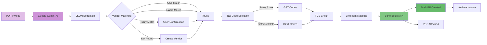
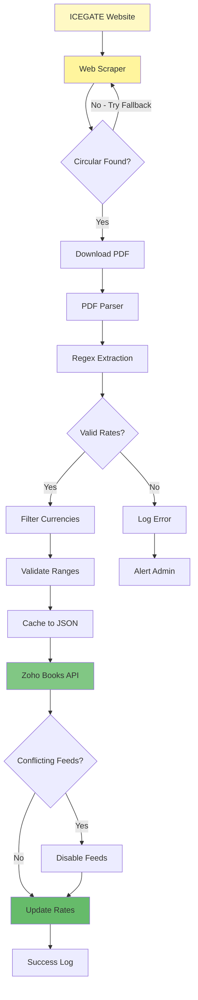
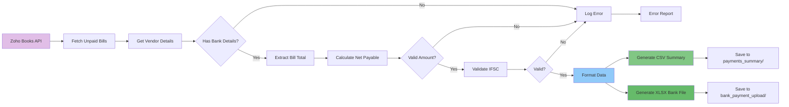
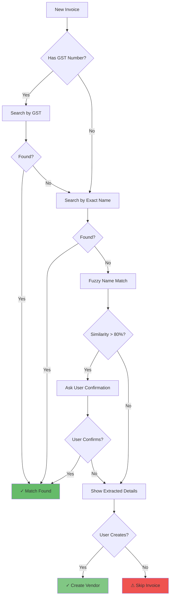
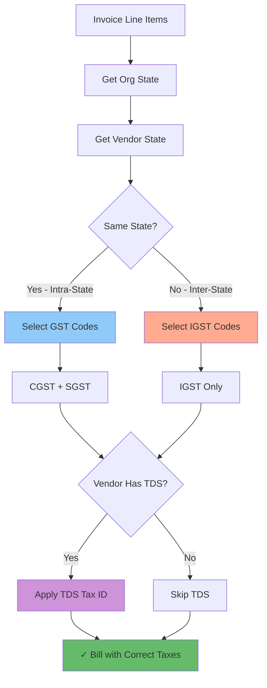
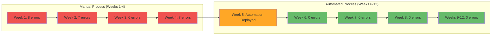
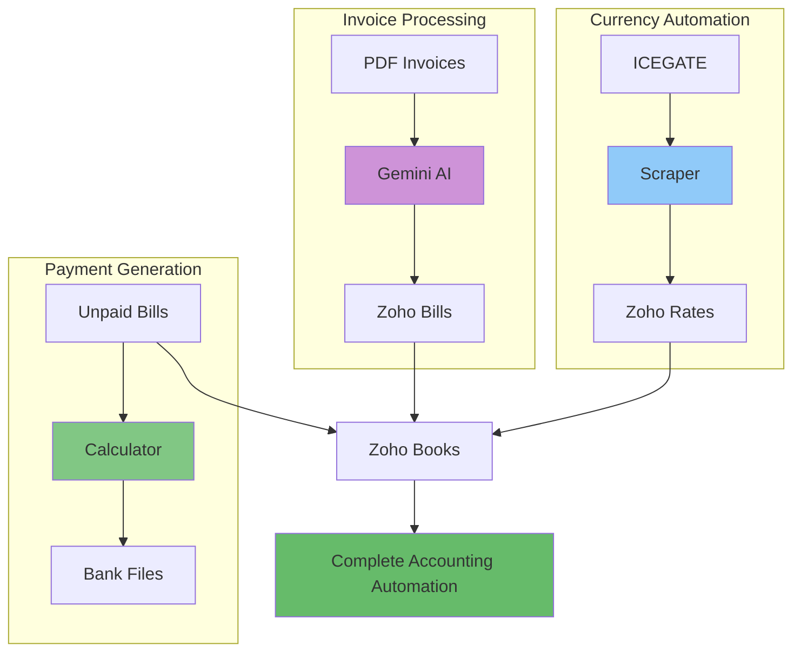
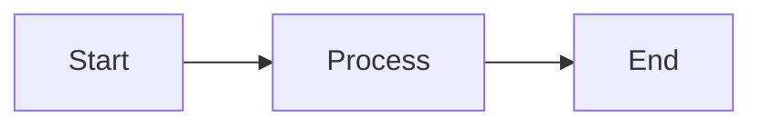

# Visual Assets for Case Studies

This document contains all visual assets created for the Zoho automation case studies.

## Generated Infographics

The following professional infographics have been created and saved:

### 1. Three Solutions Overview

**File**: `three_solutions_infographic.png`

Shows all three solutions with timeline, time savings, and error reduction metrics. Perfect for executive summary or introduction.

### 2. Invoice Processing Before/After

**File**: `invoice_before_after.png`

Visual comparison of manual vs automated invoice processing workflow. Great for showing the transformation impact.

### 3. Cost & Time Comparison

**File**: `cost_time_comparison.png`

Bar chart comparing traditional development (4-6 weeks, ₹4-5.5 lakhs) vs AI-assisted (3.5 days, ~₹0).

### 4. AI-Human Partnership

**File**: `ai_human_partnership.png`

Interlocking gears showing human expertise and AI capabilities combining to create production systems.

### 5. Development Timeline

**File**: `development_timeline.png`

Project timeline showing all three solutions developed in parallel over 3.5 days.

### 6. Annual Impact Metrics

**File**: `annual_impact_metrics.png`

Dashboard-style metrics showing time saved, cost savings, error reduction, and ROI.

---

## Mermaid Diagrams

The following diagrams can be embedded directly in markdown files using mermaid code blocks. These have been optimized with quoted labels for maximum compatibility.

### Invoice Processing System Architecture



### Currency Exchange System Architecture



### Payment File Generation Architecture



### Vendor Matching Decision Tree



### Tax Code Selection Logic



### Error Reduction Over Time



### Complete System Integration



---

## How to Use These Visuals

### In Case Study Documents

1. **Embed Generated Images**:

```markdown

```

2. **Embed Mermaid Diagrams**:

````markdown

````

### Recommended Placement

**Master Case Study** (`zoho_automation_case_study.md`):

- Three Solutions Infographic (after introduction)
- AI-Human Partnership (in "The Bigger Picture" section)
- Cost & Time Comparison (in "Economics" section)
- Annual Impact Metrics (in conclusion)
- Complete System Integration diagram (in Technical Appendix)

**Invoice Processing Case Study**:

- Invoice Before/After comparison (after "The Pain Point")
- Invoice System Architecture diagram (in "The Final System")
- Vendor Matching Decision Tree (in "Technical Challenges")
- Tax Code Selection Logic (in "Technical Challenges")

**Currency Automation Case Study**:

- Currency System Architecture (in "The Final System")
- Development Timeline (showing 1-day build)

**Payment Generation Case Study**:

- Payment System Architecture (in "The Final System")
- Error Reduction chart (in "The Impact")

---

## Visual Asset Locations

All generated images are saved in:
`Zoho Automation Case Study/visuals/`

Files:

- `three_solutions_infographic_*.png`
- `invoice_before_after_*.png`
- `cost_time_comparison_*.png`
- `ai_human_partnership_*.png`
- `development_timeline_*.png`
- `annual_impact_metrics_*.png`

---

## Additional Visual Ideas (For Future)

1. **Screenshots**:
   - Sample invoice PDF (redacted)
   - Zoho Books bill creation interface
   - Bank payment file preview
   - Terminal showing automation running

2. **Code Snippets**:
   - Sample AI prompt used
   - Configuration file example
   - Before/after code comparison

3. **Process Videos/GIFs**:
   - Invoice processing in action
   - Currency rate update running
   - Payment file generation demo

4. **Additional Charts**:
   - Weekly time savings breakdown
   - Monthly error tracking
   - ROI projection over 12 months
   - Scalability comparison (volume vs time)
