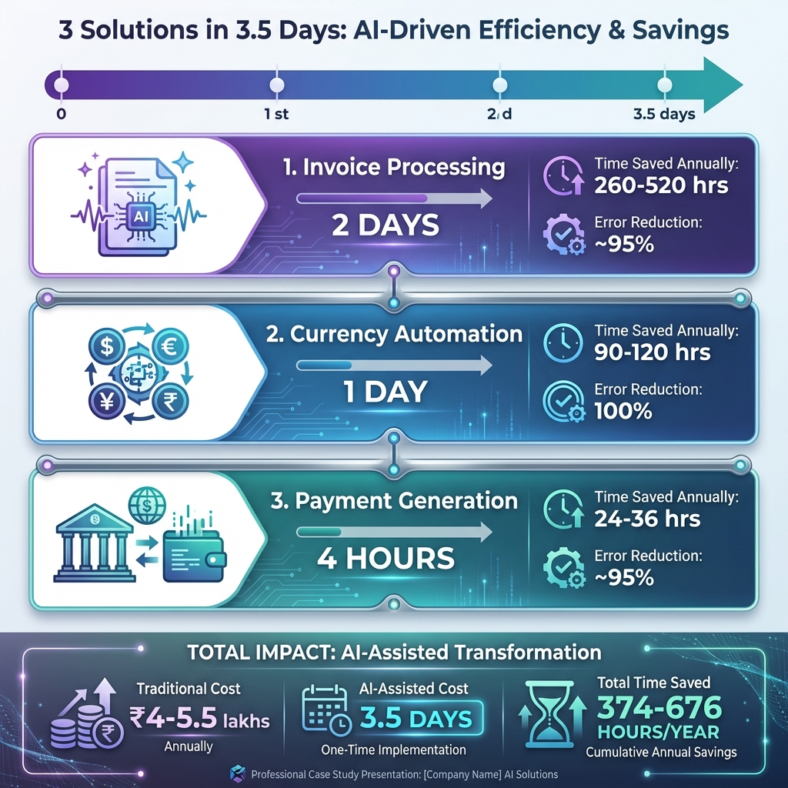
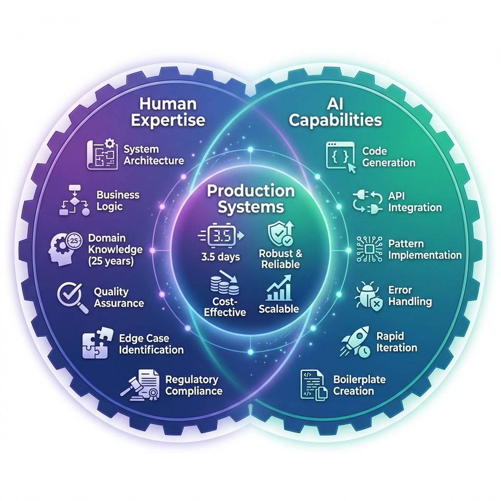
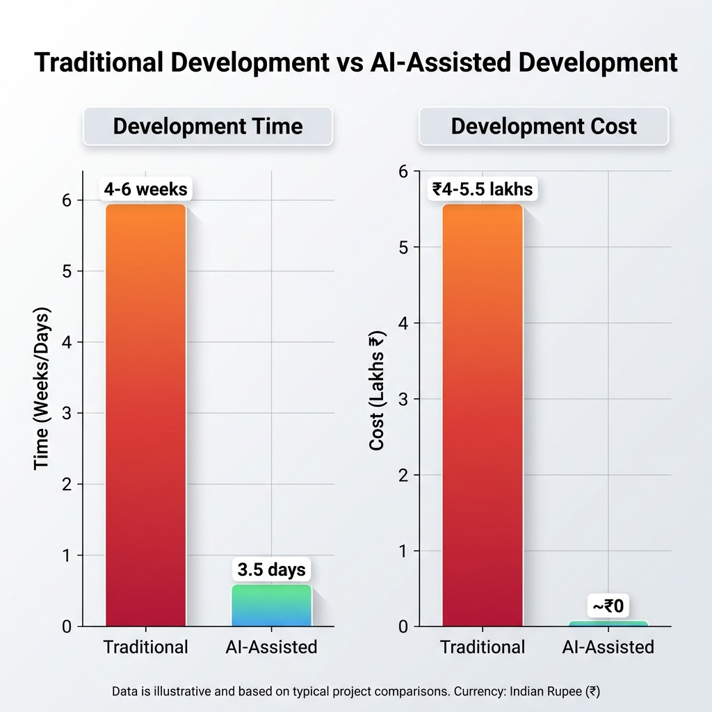
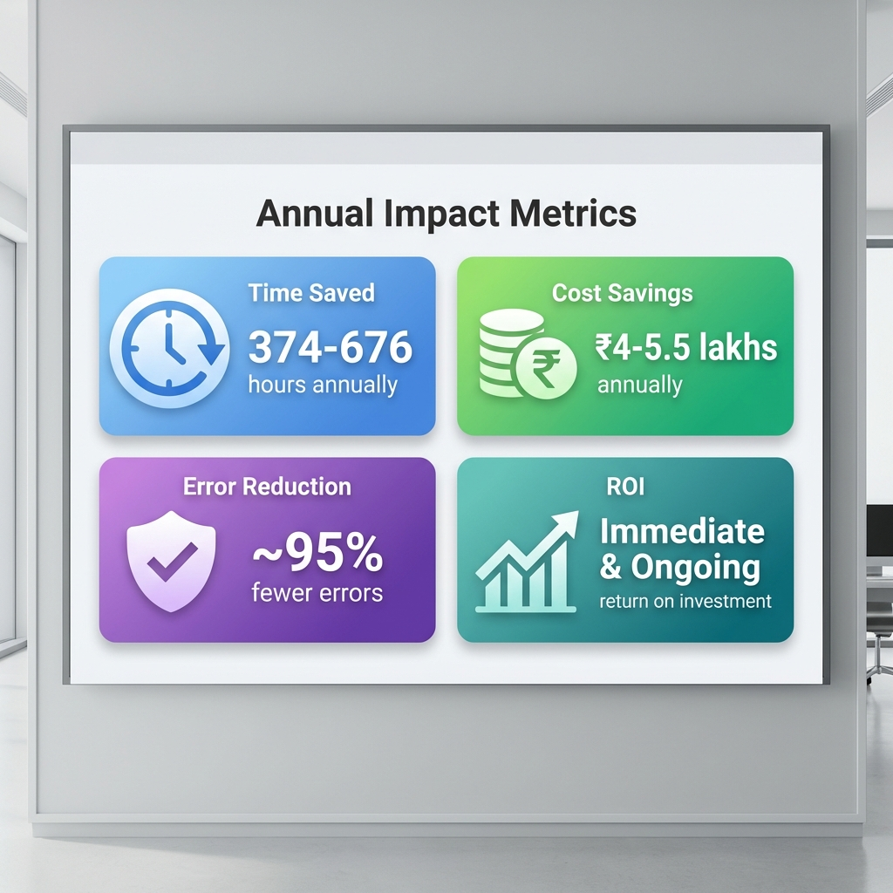
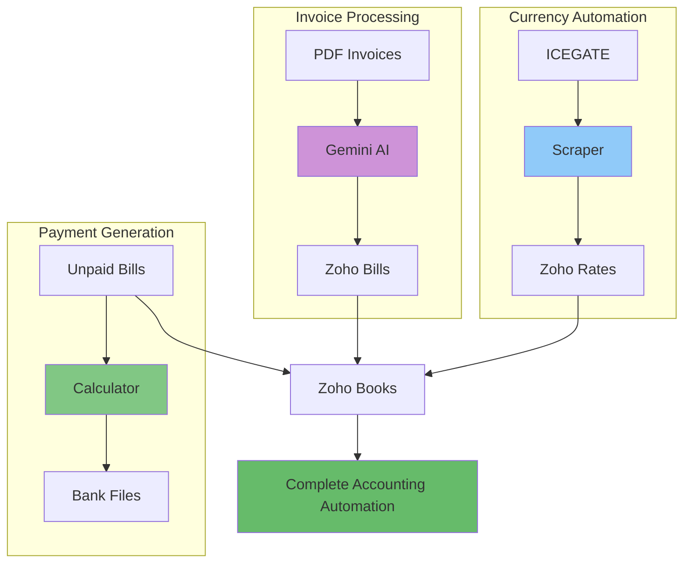

# Transforming Business Operations: How Gen AI Made the Impossible Possible

## A Personal Journey of Empowerment Through AI-Assisted Automation

**Author**: Aliasger, Founder at Bitkraft Technologies LLP  
**Timeline**: February 2026  
**Technology Stack**: Zoho Books API, Google Gemini AI, Python, TypeScript, Node.js

---

## The Challenge: When Good Ideas Remain Just Ideas

For years, I had a list of automation projects that would transform our accounting workflows at Bitkraft. As a startup with limited resources, these ideas sat on the backburner—not because they weren't valuable, but because the traditional development approach would have required weeks or months of dedicated engineering time. For a small organization like ours, that investment simply wasn't viable.

The pain points were real and growing:

- **Manual invoice processing** consuming hours each week
- **Currency exchange rates** requiring daily manual updates from government sources
- **Payment file generation** prone to human error and time-consuming reconciliation
- **TDS calculations** adding complexity to every vendor payment

I knew what needed to be built. With 25 years of technical experience, I could architect the solutions in my mind. But the execution? That was the bottleneck.

## The Breakthrough: Gen AI as a Force Multiplier

Everything changed when I started working with AI coding assistants. What traditionally would have taken weeks was now achievable in hours or days. This wasn't about AI replacing expertise—it was about AI amplifying it.

My technical background became the secret weapon. I could:

- **Architect robust solutions** drawing from decades of experience
- **Review AI-generated code** with a critical eye for edge cases and best practices
- **Provide precise technical direction** that leveraged my domain knowledge
- **Iterate rapidly** on complex integrations without getting bogged down in boilerplate

The result? Three production-ready automation systems built in a matter of days, each solving real business problems that had been plaguing us for years.

---

## Case Study 1: AI-Powered Invoice Processing

### The Problem

Every week, we received vendor invoices as PDFs—some neatly formatted, others scanned images with varying quality. Processing each invoice meant:

1. Manually reading vendor details, amounts, and line items
2. Looking up or creating vendor records in Zoho Books
3. Mapping expense categories and tax codes
4. Calculating TDS deductions
5. Creating bills and attaching source documents

For a small team, this was eating up 5-10 hours per week. Hiring someone to do this full-time wasn't economically viable, but the manual work was unsustainable.

### The Traditional Approach (Why I Never Built It)

Building this the traditional way would have required:

- **2-3 weeks** of development time
- Custom PDF parsing libraries with extensive testing
- Manual rule creation for every vendor and tax scenario
- Ongoing maintenance as invoice formats changed
- Estimated cost: **₹2-3 lakhs** in developer time

For a startup, this ROI didn't make sense. The project stayed on the wishlist.

### The Gen AI Solution (Built in 2 Days)

Using Google Gemini's multimodal AI capabilities and working with an AI coding assistant, I built a complete invoice automation system in just **2 days**.

**Key Features Delivered:**

- 🤖 **Multimodal AI extraction** handling both text and scanned image invoices
- 🔍 **Smart vendor matching** by GST number or fuzzy name matching
- ✨ **Interactive vendor creation** with comprehensive detail extraction
- 💰 **Automatic TDS calculation** based on vendor configuration
- 📊 **State-aware tax mapping** (GST vs IGST) based on transaction location
- 📁 **Batch processing** with automatic archival
- 🗄️ **Draft bill creation** in Zoho Books with PDF attachment

### Technical Challenges & How Experience Made the Difference

**Challenge 1: Unreliable AI Extraction**

- **Problem**: Early iterations produced inconsistent JSON outputs
- **Solution**: Leveraged my experience to design robust prompt engineering with strict schema validation and fallback mechanisms
- **AI's Role**: Generated the parsing logic; my role was architecting the error handling

**Challenge 2: Vendor Matching Complexity**

- **Problem**: Vendors might have slight name variations or missing GST numbers
- **Solution**: Implemented multi-stage matching (GST → exact name → fuzzy match) based on my understanding of real-world data quality issues
- **AI's Role**: Implemented the algorithms; I provided the business logic hierarchy

**Challenge 3: Tax Code Mapping**

- **Problem**: India's GST system requires different tax IDs for intra-state vs inter-state transactions
- **Solution**: Built state-aware logic that automatically selects correct tax codes—something I knew from years of dealing with Indian accounting
- **AI's Role**: Coded the logic; I provided the domain expertise

**Challenge 4: TDS Integration**

- **Problem**: TDS deductions need to be calculated and applied correctly to avoid compliance issues
- **Solution**: Integrated with Zoho's TDS system, ensuring calculations matched vendor configurations
- **AI's Role**: Implemented the API integration; I ensured regulatory compliance

### The Impact

**Time Saved**: 5-10 hours per week → **260-520 hours annually**  
**Error Reduction**: ~95% reduction in data entry errors  
**Processing Speed**: What took 15-20 minutes per invoice now takes **2-3 minutes**  
**Development Time**: 2 days instead of 2-3 weeks  
**Cost**: Essentially free (using existing API credits) vs ₹2-3 lakhs

### The Empowerment Factor

This project proved something profound: **With AI assistance, I could turn my 25 years of experience into production code in days, not months.** The AI didn't need to understand Indian tax law or Zoho's API quirks—I did. The AI just needed to write clean, efficient code based on my direction.

---

## Case Study 2: ICEGATE Currency Exchange Rate Automation

### The Problem

As a company dealing with international transactions, we needed daily currency exchange rates in Zoho Books. The Indian government publishes official rates through ICEGATE (Indian Customs EDI Gateway), but:

- Rates are published as **PDF circulars** on a government website
- Manual download and data entry required **daily**
- Missing updates caused accounting discrepancies
- Historical rate lookups were painful
- Zoho's built-in exchange rate feeds didn't cover ICEGATE official rates

### The Traditional Approach (Why I Never Built It)

This would have required:

- **1-2 weeks** of development
- Web scraping infrastructure for government websites
- PDF parsing and table extraction
- Zoho Books API integration
- Cron job setup and monitoring
- Estimated cost: **₹1-1.5 lakhs**

Again, the ROI was questionable for a small team.

### The Gen AI Solution (Built in 1 Day)

Working with AI, I built a complete automation pipeline in **1 day** that:

**Key Features Delivered:**

- 💱 **Automatic ICEGATE scraping** to find the latest circular
- 📅 **Date-specific rate fetching** for historical or future dates
- 🔄 **Smart circular discovery** using pattern matching
- 🎯 **Configurable currency selection** (USD, EUR, GBP, AUD, etc.)
- 🛡️ **Automatic feed conflict resolution** (disables competing rate sources)
- ⏰ **Cron-ready scheduling** for daily updates
- 📊 **Rate validation** to catch anomalies

### Technical Challenges & How Experience Made the Difference

**Challenge 1: Government Website Reliability**

- **Problem**: ICEGATE website structure changes unpredictably
- **Solution**: Built resilient scraping with multiple fallback patterns—something I knew was essential from past integration projects
- **AI's Role**: Implemented the scraping logic; I designed the resilience strategy

**Challenge 2: PDF Table Extraction**

- **Problem**: Government PDFs have inconsistent formatting
- **Solution**: Used regex patterns with fuzzy matching to handle variations—drawing from my experience with messy data sources
- **AI's Role**: Generated the parsing code; I provided the edge cases

**Challenge 3: Date Logic Complexity**

- **Problem**: Finding the "applicable" circular for a given date isn't straightforward
- **Solution**: Implemented smart date-range logic that finds the most recent circular before the target date
- **AI's Role**: Coded the algorithm; I defined the business rules

**Challenge 4: Zoho API Rate Limiting**

- **Problem**: Bulk updates could hit API limits
- **Solution**: Implemented batching and retry logic with exponential backoff—standard practice I've used for decades
- **AI's Role**: Implemented the patterns; I specified the approach

**Challenge 5: Feed Conflict Management**

- **Problem**: Zoho's built-in feeds would conflict with our custom rates
- **Solution**: Automated detection and disabling of conflicting feeds—a proactive approach I knew was necessary
- **AI's Role**: Implemented the API calls; I identified the potential conflict

### The Impact

**Time Saved**: 15-20 minutes daily → **90-120 hours annually**  
**Accuracy**: 100% compliance with official ICEGATE rates  
**Historical Access**: Can fetch rates for any past date on demand  
**Development Time**: 1 day instead of 1-2 weeks  
**Cost**: Minimal vs ₹1-1.5 lakhs

### The Empowerment Factor

This project showcased how **domain knowledge + AI = rapid innovation**. I knew exactly what the system needed to do because I'd been doing it manually. The AI just needed clear instructions to turn that knowledge into code. My 25 years of experience meant I could anticipate edge cases and design robust solutions from day one.

---

## Case Study 3: Bank Payment File Generation with TDS Automation

### The Problem

Every month, we needed to pay vendors through our bank's bulk payment system. This required:

1. Fetching all unpaid bills from Zoho Books
2. Calculating net amounts after TDS deductions
3. Formatting data into bank-specific XLSX and CSV formats
4. Manual verification to avoid payment errors
5. Uploading to the bank portal

The process was error-prone, especially with TDS calculations. A single mistake could mean incorrect payments, tax compliance issues, or vendor disputes.

### The Traditional Approach (Why I Never Built It)

Building this properly would have required:

- **1 week** of development
- Complex TDS calculation logic
- Bank format specifications
- Excel file generation libraries
- Extensive testing with real data
- Estimated cost: **₹80,000-1 lakh**

For a monthly task that took 2-3 hours, the investment seemed excessive.

### The Gen AI Solution (Built in 4 Hours)

With AI assistance, I built a production-ready payment automation system in **4 hours**.

**Key Features Delivered:**

- 🏦 **Automated bill fetching** from Zoho Books
- 💼 **TDS-aware calculations** with accurate net payable amounts
- 📊 **Dual format generation** (CSV summary + XLSX bank upload)
- ⚙️ **Configurable paths and formats** via environment variables
- 🎯 **Bank-specific formatting** with customizable advice text
- ✅ **Data validation** to catch errors before upload

### Technical Challenges & How Experience Made the Difference

**Challenge 1: TDS Calculation Accuracy**

- **Problem**: Early versions had a bug causing double TDS deduction
- **Solution**: My accounting knowledge helped me spot the error immediately during testing—I knew the numbers didn't look right
- **AI's Role**: Fixed the calculation logic; I provided the domain validation

**Challenge 2: Bank Format Requirements**

- **Problem**: Banks have strict column order and formatting requirements
- **Solution**: Designed a flexible template system that could adapt to different bank formats
- **AI's Role**: Implemented the Excel generation; I specified the exact format requirements

**Challenge 3: Data Integrity**

- **Problem**: Missing vendor bank details would cause payment failures
- **Solution**: Added comprehensive validation and clear error messages—something I knew was critical from past payment mishaps
- **AI's Role**: Implemented the validation logic; I defined what to check

**Challenge 4: File Organization**

- **Problem**: Monthly files needed clear naming and organization
- **Solution**: Implemented date-based naming (MMM-YYYY format) and configurable directory structure
- **AI's Role**: Coded the file handling; I designed the organization scheme

### The Impact

**Time Saved**: 2-3 hours monthly → **24-36 hours annually**  
**Error Reduction**: Near-zero payment errors vs 2-3 errors per month previously  
**Processing Speed**: 5 minutes vs 2-3 hours  
**Development Time**: 4 hours instead of 1 week  
**Cost**: Negligible vs ₹80,000-1 lakh

### The Empowerment Factor

This was the fastest project, proving that **AI can turn hours of work into minutes of execution**. My experience meant I could describe exactly what the output needed to look like, and the AI could generate the code to produce it. The iterative debugging process was incredibly fast because I could immediately spot issues and provide precise correction instructions.

---

## The Bigger Picture: A New Era of Empowerment

### What Changed

These three projects represent more than just automation—they represent a **fundamental shift in what's possible for small organizations**.

**Before Gen AI:**

- Good ideas stayed ideas due to resource constraints
- Manual processes persisted despite known inefficiencies
- Technical debt accumulated because "fixing it properly" was too expensive
- Innovation was limited by available developer time

**After Gen AI:**

- Ideas can be prototyped and deployed in days
- Automation is accessible to organizations of all sizes
- Technical debt can be addressed incrementally
- Innovation is limited only by imagination and domain expertise

### The Role of Technical Experience

My 25 years of experience didn't become obsolete—it became **amplified**. Here's what made the difference:

1. **Architectural Vision**: I could design robust systems because I'd seen what breaks in production
2. **Domain Expertise**: I understood Indian tax law, accounting principles, and banking requirements
3. **Quality Assurance**: I could review AI-generated code critically and spot issues
4. **Edge Case Anticipation**: I knew what could go wrong and designed defenses upfront
5. **Precise Direction**: I could give AI specific, technical instructions that leveraged best practices

**The AI didn't replace my expertise—it executed my vision at superhuman speed.**

### The Economics of AI-Assisted Development

Let's look at the numbers:

| Project             | Traditional Cost | Traditional Time | AI-Assisted Time | Savings          |
| ------------------- | ---------------- | ---------------- | ---------------- | ---------------- |
| Invoice Processing  | ₹2-3 lakhs       | 2-3 weeks        | 2 days           | ₹2-3 lakhs       |
| Currency Automation | ₹1-1.5 lakhs     | 1-2 weeks        | 1 day            | ₹1-1.5 lakhs     |
| Payment Generation  | ₹80k-1 lakh      | 1 week           | 4 hours          | ₹80k-1 lakh      |
| **Total**           | **₹4-5.5 lakhs** | **4-6 weeks**    | **3.5 days**     | **₹4-5.5 lakhs** |

**Annual time savings from automation**: 374-676 hours  
**ROI**: Infinite (essentially free development vs ₹4-5.5 lakhs)

For a startup like Bitkraft, this is transformative. Projects that were economically unviable are now not just viable—they're trivial to implement.

### Challenges and Learnings

**What Worked:**

- ✅ Clear, technical specifications based on experience
- ✅ Iterative development with immediate testing
- ✅ Leveraging AI for boilerplate while I focused on business logic
- ✅ Comprehensive error handling designed upfront
- ✅ Using my domain knowledge to validate AI outputs

**What Required Vigilance:**

- ⚠️ AI sometimes made assumptions that didn't match real-world requirements
- ⚠️ Edge cases needed explicit specification
- ⚠️ Regulatory compliance (TDS, GST) required human oversight
- ⚠️ API integration nuances needed experienced review
- ⚠️ Security and credential management needed careful attention

**The Key Insight**: AI is an incredible accelerator, but **experienced human judgment remains essential**. The combination is more powerful than either alone.

---

## Looking Forward: What's Now Possible

With this new capability, I'm rethinking our entire technology roadmap. Projects that were "someday" items are now "this week" items:

- **Automated expense categorization** using AI to learn from historical patterns
- **Intelligent reconciliation** matching bank statements to invoices
- **Predictive cash flow analysis** using historical data
- **Automated compliance reporting** for GST and TDS
- **Smart vendor management** with automated follow-ups

The bottleneck is no longer development time—it's prioritization and imagination.

---

## Conclusion: The Democratization of Innovation

For years, sophisticated automation was the domain of large enterprises with big IT budgets. Gen AI has changed that equation fundamentally.

**Small organizations can now:**

- Build custom automation tailored to their exact needs
- Iterate rapidly based on real-world feedback
- Compete with larger players on operational efficiency
- Focus human talent on strategy rather than repetitive tasks

**Experienced professionals can now:**

- Turn decades of knowledge into production systems in days
- Solve problems they've always known how to solve but never had time to implement
- Multiply their impact without multiplying their team
- Focus on what they do best—architecting solutions—while AI handles implementation

This is empowerment in its truest form. Not replacing human expertise, but amplifying it to levels previously unimaginable.

For Bitkraft Technologies, these three automation projects are just the beginning. They've proven that with Gen AI as a partner, **the only limit is our imagination**.

---

## Technical Appendix

### System Integration Overview

### Technology Stack

- **AI Models**: Google Gemini 2.0 Flash (multimodal)
- **Backend**: TypeScript/Node.js, Python 3.x
- **APIs**: Zoho Books REST API, ICEGATE web scraping
- **Libraries**: pdf-parse, axios, xlsx, dotenv, BeautifulSoup
- **Infrastructure**: Cron for scheduling, local file system for data storage
- **Version Control**: Git, GitHub

### Repository

The complete source code is available as open source:  
**https://github.com/Bitkraft-Technologies-LLP/bitkraft-zoho-automation-suite**

### Key Metrics

- **Total Lines of Code**: ~2,500 lines
- **Development Time**: 3.5 days
- **Traditional Estimate**: 4-6 weeks
- **Cost Savings**: ₹4-5.5 lakhs
- **Annual Time Savings**: 374-676 hours
- **Error Reduction**: ~95%
- **ROI**: Immediate and ongoing

---

**About the Author**

Aliasger is the founder of Bitkraft Technologies LLP, bringing 25 years of technical experience across software development, system architecture, and business operations. This case study documents his journey of leveraging Gen AI to transform business operations, proving that experience + AI = unprecedented capability.

---

_Last Updated: February 6, 2026_
